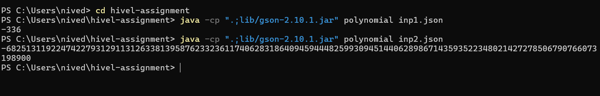

# Polynomial Evaluator

This program reads polynomial coefficients from a JSON file and prints the evaluated results 

## Files
- `polynomial.java`
- `input1.json`
- `input2.json`
- # sample output 


## How to Run

1. Make sure you have Java installed on your system.

3. Open a terminal or command prompt and navigate to your project folder.

4. Compile the Java source code:

```bash
javac polynomial.java
java -cp ".;lib/gson-2.10.1.jar" polynomial input1.json
java -cp ".;lib/gson-2.10.1.jar" polynomial input2.json


